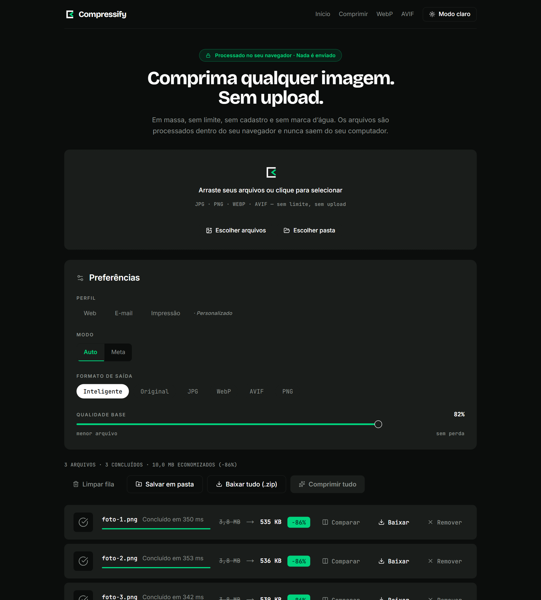
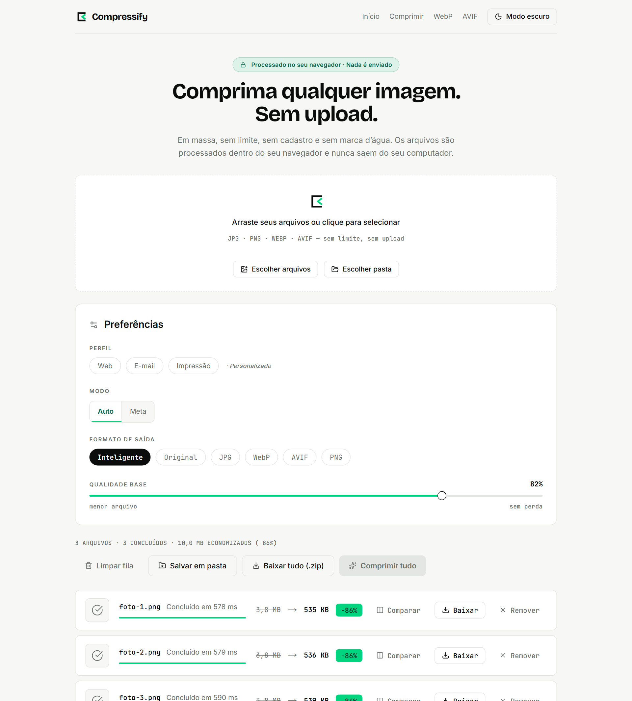

# Compressify

**Comprima e converta imagens em massa direto no navegador. Nenhum arquivo é enviado para servidor algum.**

Não é uma promessa de política de privacidade: é uma propriedade da arquitetura. O site é
uma exportação estática — não existe função de servidor para onde enviar nada — e há um
teste que intercepta toda requisição de rede, em três navegadores, e falha se qualquer
uma delas levar um byte do arquivo do usuário.



<details>
<summary>Modo claro</summary>



</details>

---

## O que ele faz

- **Compressão em lote** de JPG, PNG, WebP e AVIF, com progresso por arquivo e
  cancelamento a qualquer momento.
- **Dois modos:** automático, que desce uma escada de qualidade até o arquivo ficar menor
  que o original; e **meta de tamanho**, que faz busca binária na qualidade e, se ainda
  não couber, reduz a resolução em degraus — sem descer abaixo de 900 px no menor lado.
- **Conversão** para qualquer um dos quatro formatos, ou o modo inteligente, que leva
  tudo para WebP e mantém AVIF como AVIF.
- **Três saídas:** baixar um arquivo, baixar o lote em `.zip`, ou salvar direto numa pasta
  do disco onde o navegador oferece a File System Access API.
- **Pastas inteiras**, com a estrutura de subpastas preservada na saída.
- **Comparação antes/depois** com divisória arrastável — ou operável pelas setas do
  teclado, porque é um `<input type="range">` de verdade.
- **Perfis** (web, e-mail, impressão) e preferências que sobrevivem à aba fechada.
- **Funciona sem rede.** Depois da primeira visita o app abre offline, e depois da
  primeira compressão ele **comprime** offline — os codecs ficam em cache quando são
  usados.

Tudo com `Worker` + WebAssembly: a thread principal nunca toca em pixel nenhum.

**Os metadados não sobrevivem.** O pipeline decodifica para pixels e recodifica do zero,
então EXIF, IPTC, XMP e perfil ICC não atravessam — a coordenada de onde a foto foi
tirada não sai do outro lado. A orientação é a exceção deliberada: ela não é preservada
como metadado, é **aplicada aos pixels**, então a foto em pé sai em pé.

## Números medidos

|                                 |                                                                                   |
| ------------------------------- | --------------------------------------------------------------------------------- |
| Lighthouse (home)               | **95** performance · **100** acessibilidade · **100** boas práticas · **100** SEO |
| JavaScript inicial              | 141 KB com gzip em 8 arquivos — **zero** bytes de codec                           |
| Página inteira, primeira visita | 277 KB com gzip                                                                   |
| Casco cacheado para uso offline | 832 KB — os 9,7 MB de codec entram só quando são usados                           |
| Lote de 3 PNGs de 1600×1200     | 11,4 MB → 1,6 MB (**−86%**), ~400 ms por arquivo no Chromium                      |
| Quantizador de PNG, 12 MP       | 92 ms                                                                             |
| Paridade com o app desktop      | **±0,4%** no modo meta, contra o Electron/`sharp` sobre os mesmos bytes           |
| Testes                          | 348 de unidade e integração + 97 E2E em Chromium, Firefox e WebKit                |

O Lighthouse é medido contra `out/` servido com gzip, como a Vercel serve — medir sem
compressão reprova o harness, não a página. O número já foi **98** numa máquina em
repouso; os 95 acima são de uma máquina rodando build e testes. O service worker foi
medido com e sem: a diferença é de no máximo 1 ponto.

Os codecs (9,7 MB de `.wasm`) só são baixados quando um job produz aquele formato — o
`avif_enc` de 3,4 MB nunca é tocado por quem só comprime JPG.

## Como rodar

```bash
npm install
npm run dev          # http://localhost:3000
```

```bash
npm run check        # typecheck + lint + formatação + 348 testes
npm run build        # exportação estática em out/
npx playwright install && npm run e2e   # 97 testes nos três navegadores
```

Requer Node 20.9+. O `npm run build` usa webpack em vez de Turbopack — o motivo está em
[`docs/HANDOFF.md` §4](docs/HANDOFF.md).

## Como funciona

```
thread principal                        workers
─────────────────                       ───────
Dropzone → queueStore (Zustand)
              │
       QueueOrchestrator ──┐
              │            │  postMessage
         WorkerPool ───────┼──► image.worker × N
   (núcleos E megapixels)  │      decode → estratégia → resize → encode
                           └──► zip.worker
                                  fflate, método stored
```

Quatro fronteiras, cada uma escolhida para deixar o lado de dentro testável:

| Camada       | Arquivo                    | Testável porque                                               |
| ------------ | -------------------------- | ------------------------------------------------------------- |
| Estratégia   | `engine/image/strategy.ts` | não importa WASM, canvas nem DOM — recebe uma função `render` |
| Motor        | `engine/image/engine.ts`   | os codecs entram por injeção                                  |
| Concorrência | `engine/core/pool.ts`      | recebe uma fábrica de workers                                 |
| Fila         | `store/queue.ts`           | recebe uma fábrica de orquestrador                            |

É por isso que 329 dos 348 testes rodam sem carregar um byte de WebAssembly, e
a concorrência inteira — orçamento de memória, cancelamento com worker travado,
retentativa — é exercitada em Node. O E2E fecha por fora: o que as fronteiras permitiram
testar isolado, ele prova junto, num navegador de verdade.

Detalhes em [`docs/ARQUITETURA.md`](docs/ARQUITETURA.md).

## Documentação

| Arquivo                                                      | O que tem                                                      |
| ------------------------------------------------------------ | -------------------------------------------------------------- |
| [`docs/HANDOFF.md`](docs/HANDOFF.md)                         | **Comece aqui.** Estado, decisões, armadilhas e riscos abertos |
| [`docs/ARQUITETURA.md`](docs/ARQUITETURA.md)                 | As camadas, as fronteiras e por que cada uma está onde está    |
| [`docs/PLANO.md`](docs/PLANO.md)                             | O plano técnico da refatoração, com as decisões justificadas   |
| [`docs/SPIKE.md`](docs/SPIKE.md)                             | As medições que derrubaram quatro suposições do plano          |
| [`docs/COMPARACAO-ELECTRON.md`](docs/COMPARACAO-ELECTRON.md) | A paridade com o app desktop, gerada por medição               |
| [`docs/ROADMAP.md`](docs/ROADMAP.md)                         | Fase 2 (PDF) e Fase 3 (vídeo e áudio)                          |

## Origem

Este projeto começou como um **aplicativo desktop em Electron + Sharp**, preservado na tag
[`v1.0.0-electron`](../../releases/tag/v1.0.0-electron) e na branch `legacy/electron`. O
algoritmo de compressão — a escada de qualidade e a busca binária com downscale — é um
porte fiel daquele código, com duas mudanças deliberadas de comportamento, ambas
documentadas e testadas ([`docs/PLANO.md` §3.1](docs/PLANO.md)).

O que mudou foi o entorno: o Sharp virou WebAssembly, o processo do Electron virou um pool
de workers, e o que era um instalador de 400 MB virou uma página que cabe em 141 KB.

Que as duas versões comprimem igual não é afirmação: o app desktop roda dentro da suíte de
testes, com o mesmo `sharp` 0.33.5 daquela tag, sobre os mesmos bytes —
[`docs/COMPARACAO-ELECTRON.md`](docs/COMPARACAO-ELECTRON.md).

## Tecnologias

Next 16 (App Router, `output: 'export'`) · React 19 · TypeScript 6 · Tailwind 4 ·
Zustand 5 · [jSquash](https://github.com/jamsinclair/jSquash) (mozjpeg, libwebp, libavif,
oxipng) · fflate · Vitest · Playwright

Sem analytics, sem telemetria, sem script de terceiros. As fontes são auto-hospedadas pelo
`next/font` justamente por isso.

## Licença

MIT — [Igor de Castro](https://github.com/Igorpcferreira)
